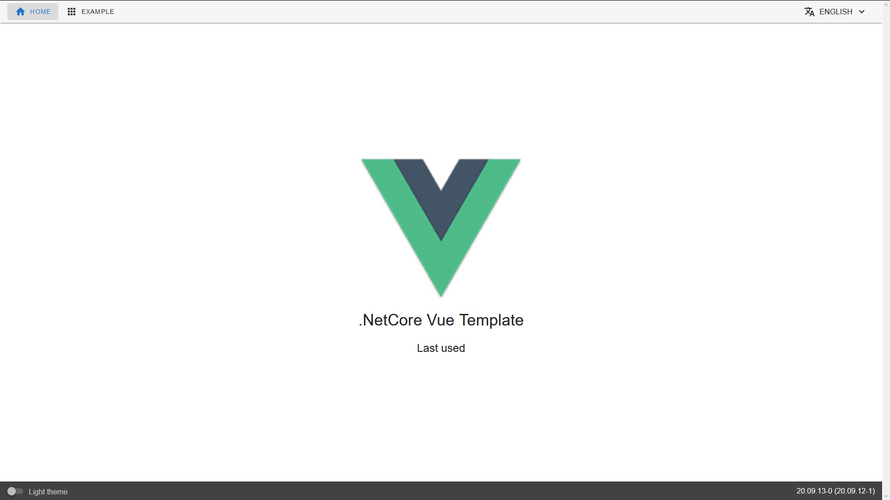
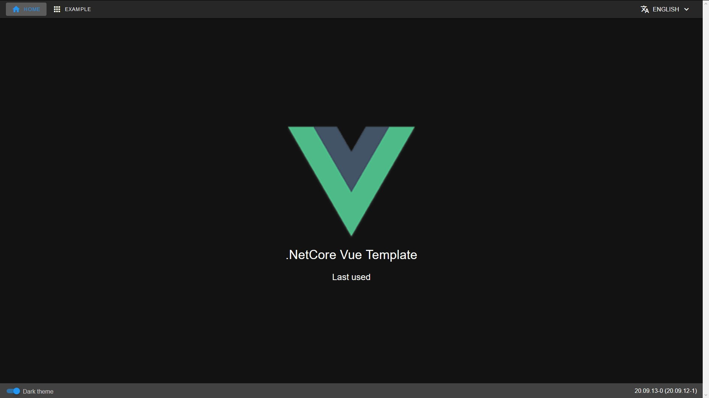

# .Net Core Vue Template - Frontend

[](https://vuejs.org/)
[](./src/)

[](./tests/unit/)
[](./tests/unit/)
[](./tests/unit/)
[](./tests/unit/)

The frontend for the i18n service.

### Screenshots

| Light | Dark |
| ----- | ---- |
|  |  |

### NPM Scripts

```
npm run build                 // Compiles and minifies for production
npm run libs                  // Links the src of project vue-library as libs
npm run lint                  // Lints and fixes files
npm run pre-push              // Runs 'lint', 'test:unit' and 'build'
npm run serve                 // Compiles and hot-reloads for development
npm run test:unit             // Run your unit tests
npm run test:e2e              // Run your end-to-end tests
npm run update-local-version  // Updates the version for this application in this README.md, the package.json and the package-lock.json, stages and commits these files
```

### Attention

This project needs my [vue-library](https://github.com/JonasSchubert/vue-library) to be linked using above command `npm run libs`.

### Customize configuration

See [Configuration Reference](https://cli.vuejs.org/config/).
